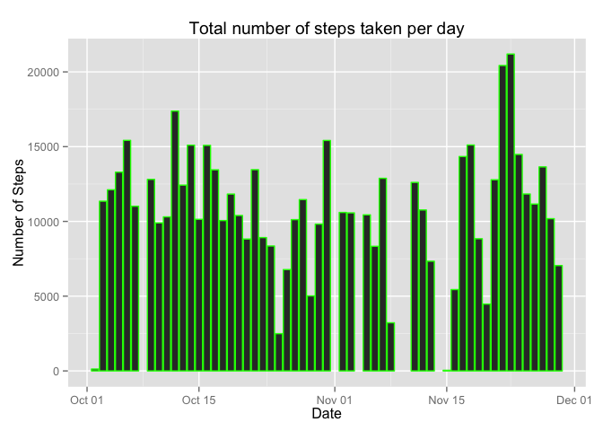
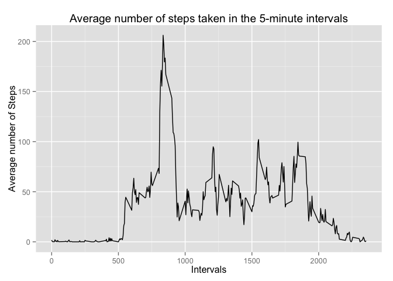
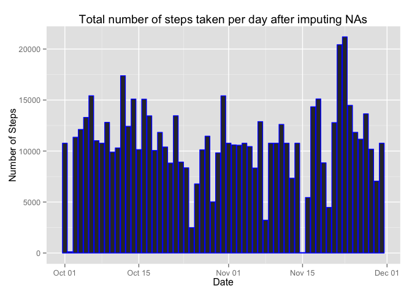
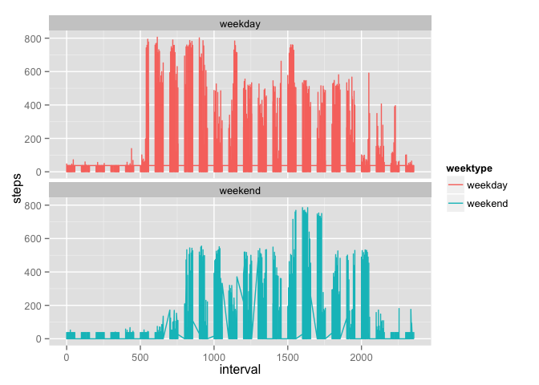

# Reproducible Research: Peer Assessment 1


## Loading and preprocessing the data
Download and unzip the data

```r
# unzip the activity.zip file if activity.csv does not exist
if (!file.exists("activity.csv")) {
  unzip("activity.zip")
}
```

Read the data into a data frame and change the date format into Date

```r
# read activity.csv
activity.file <- read.csv("activity.csv", stringsAsFactors = FALSE, na.strings ="NA")

# convert the date (column 2) from chr to Date format
activity.file[, 2] <- as.Date(activity.file[, 2]) ## format column 2 (date) as Date
```


## What is mean total number of steps taken per day?

Remove missing values and calculate the number of steps per day.
Plot the total number of steps taken per day

```r
activity <- subset(na.omit(activity.file)) ## remove NA
steps.per.day <- aggregate(steps ~ date, activity, sum) ## calculate the number of steps per day

library(ggplot2)
h <- ggplot(steps.per.day, aes(x=date, y=steps)) + 
      geom_bar(stat = "identity", colour="green") + 
      ggtitle("Total number of steps taken per day") + 
      xlab("Date") + 
      ylab("Number of Steps")
print(h)
```

 

Compute the mean and median


```r
mean.steps <- mean(steps.per.day$steps) ## compute the mean of steps per day
mean.steps
```

```
## [1] 10766.19
```

```r
median.steps <- median(steps.per.day$steps)## compute the median of steps per day
median.steps
```

```
## [1] 10765
```

### The mean is 1.0766189\times 10^{4} and the median is 10765.


## What is the average daily activity pattern?
 Calculate the mean steps in the 5-minute intervals and then plot the time series

```r
steps.interval <- aggregate(steps ~ interval, activity, mean) ## calculate the mean steps in the 5-min intervals

j <- ggplot(steps.interval, aes(interval)) + 
     geom_line(aes(y=steps)) +
     ggtitle("Average number of steps taken in the 5-minute intervals") +
     xlab("Intervals") + 
     ylab("Average number of Steps")
print(j)
```

 


Find which interval has the maximum number of steps


```r
the.interval <- steps.interval$interval[which.max(steps.interval$steps)] # determine which interval has the maximun number of steps
the.interval
```

```
## [1] 835
```
### The interval that contains the maximum number of steps is 835.


## Imputing missing values
Find the total number of missing values.

```r
total.NA <- sum(is.na(activity.file$steps))
total.NA
```

```
## [1] 2304
```
### The total number of missing values in the data aset is 2304

Impute missing values with the mean number of steps per day

```r
library(Hmisc)
```

```
## Loading required package: grid
## Loading required package: lattice
## Loading required package: survival
## Loading required package: Formula
## 
## Attaching package: 'Hmisc'
## 
## The following objects are masked from 'package:base':
## 
##     format.pval, round.POSIXt, trunc.POSIXt, units
```

```r
impute.data <- activity.file
impute.data$steps <- impute(activity.file$steps, fun=mean)
new.steps.per.day <- aggregate(steps ~ date, impute.data, sum) ## sum of steps per day for impute data
```
Plot the total number of steps taken per day after missing values were imputed.


```r
k <- ggplot(new.steps.per.day, aes(x=date, y=steps)) + 
        geom_bar(stat = "identity", colour="blue") + 
        ggtitle("Total number of steps taken per day after imputing NAs") + 
        xlab("Date") + 
        ylab("Number of Steps")
print(k)
```

 

Compute the mean and median for the newly imputed data

```r
new.mean.steps <- mean(new.steps.per.day$steps) ## compute the mean for steps per day for impute data
new.mean.steps
```

```
## [1] 10766.19
```

```r
new.median.steps <- median(new.steps.per.day$steps) ## compute the median of steps per day for impute data
new.median.steps
```

```
## [1] 10766.19
```

### The mean is 1.0766189\times 10^{4} and the median is 1.0766189\times 10^{4}.


## Are there differences in activity patterns between weekdays and weekends?
Use the weekdays function to determine the type of day as either weekend or weekday

```r
library(dplyr)
```

```
## 
## Attaching package: 'dplyr'
## 
## The following objects are masked from 'package:Hmisc':
## 
##     combine, src, summarize
## 
## The following objects are masked from 'package:stats':
## 
##     filter, lag
## 
## The following objects are masked from 'package:base':
## 
##     intersect, setdiff, setequal, union
```

```r
impute.data <- mutate(impute.data, weektype = ifelse(weekdays(impute.data$date) == "Saturday" | 
                weekdays(impute.data$date) == "Sunday", "weekend", "weekday"))
```

Change the new weektype column to factor and look at the structure of the data


```r
impute.data$weektype <- as.factor(impute.data$weektype)
str(impute.data)
```

```
## 'data.frame':	17568 obs. of  4 variables:
##  $ steps   :Class 'impute'  atomic [1:17568] 37.4 37.4 37.4 37.4 37.4 ...
##   .. ..- attr(*, "imputed")= int [1:2304] 1 2 3 4 5 6 7 8 9 10 ...
##  $ date    : Date, format: "2012-10-01" "2012-10-01" ...
##  $ interval: int  0 5 10 15 20 25 30 35 40 45 ...
##  $ weektype: Factor w/ 2 levels "weekday","weekend": 1 1 1 1 1 1 1 1 1 1 ...
```

Change the steps type to numeric and plot the graph into panel based on weektype


```r
impute.data$steps <- as.numeric(impute.data$steps)

g <- ggplot(impute.data, aes(interval, steps, color = weektype)) +
        geom_line() + facet_wrap(~ weektype, ncol=1)
print(g)
```

 

There is a slight difference in activity pattern between weekdays and weekends.  More steps were taken during the morning of weekdays compared to weekends.
